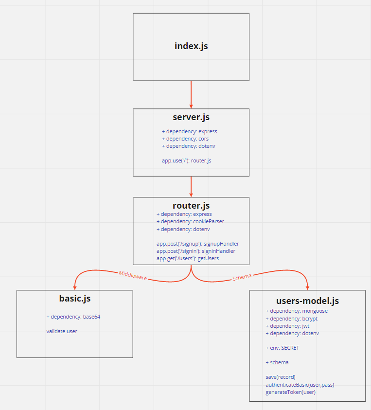

# LAB - Class 12

## Project: Auth Server

### Author: Abdulhakim Zatar

### Links and Resources

- [ci/cd](https://github.com/zatar-401-advanced-javascript/auth-server/actions) (GitHub Actions)

### Setup

#### `.env` requirements (where applicable)

i.e.

- `PORT` - Port Number
- `MONGODB_URI` - URL to the running mongo instance/db
- `SECRET` - Secret key for jwt
- `CLIENT_ID` - id of provider
- `CLIENT_SECRET` - Secret of provider

#### How to initialize/run your application (where applicable)

- `npm i dotenv express base-64 jsonwebtoken mongoose bcrypt cors cookie-parser superagent`
- e.g. `npm start`

#### How to use your library (where applicable)

#### Tests

- `npm i -D eslint supergroose jest`

#### UML

